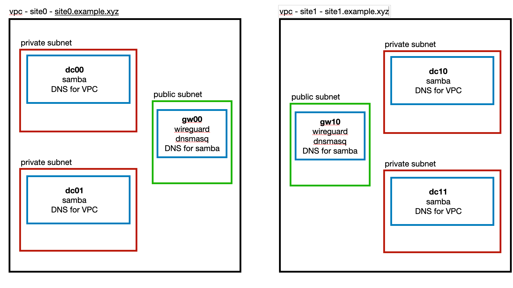

# Samba Cluster

This project uses AWS to simulate a multi-site studio, with two sites (as VPCs) in different regions. It populates
the VPCs with one public and two private subnets, each in different zones. In the public subnet, there is a
gateway server running wireguard (to connect to the other VPC) and dnsmasq. Within each private subnet
pair, it builds a samba cluster - note that the samba clusters across VPCs are separate systems.

The built system looks like the following diagram. Each server is running Ubuntu 22.04 LTS.

The routing and security groups are setup to allow the machines in one site to access the machines in the
other.

The DNS is setup to resolve hostnames in each VPC. This works by the following:

* each VPC has a DHCP options set which sets the Samba servers as the VPC's DNS server
* each samba server is configured to use their gatway server as their DNS forwarder
* each dnsmasq server resolves the other domain's hosts using the samba servers in the other VPC
* each dnsmasq server uses the VPC dns server as its default upstream server

Getting the DNS right was the thing that took the most time. The `systemd-resolved` needed to have it's
stub resolver disabled on the gateway and samba servers, and temporary `/etc/resolv.conf` files needed
to be created during installation and then replaced with a final version once setup. It's not difficult,
it just took a bit of trial and error to get the sequencing right.

With the DHCP option set for each VPC configured to use the samba servers, new servers added to any
of the subnets should have their DNS working out of the box with no configuration needed.

The samba setup pretty much exactly followed the instructions in the samba wiki.

## Prerequisites

You need an AWS account for this to work. If you can get the AWS CLI working, then you will
have everything in place that you need to get this to run.

Terraform is used to build the AWS infrastructure and also create the ansible scripts.

Ansible is used to configure the servers.

## Quick Start

The build and configuration is fully automated and there's just a few things to do to build the system.

Copy the `terraform.tfvars.example` file to `terraform.tfvars` and update the aws profile and region variables
to match your aws environment.

Build the infrastructure and ansible configurations:

    terraform init
    terraform apply

This create a directory called `local` and in there you can see the ansible configs as well as an
ssh configuration file so you can log into all the machines that have been created. For example,
to log into the server dc00 run:

    ssh -F local/ssh.cfg dc00

Before moving on to the next step, wait for the servers to be fully up and running. If you can log
into them and see that their hostname is different from the default AWS naming, then everything is
ready.

Configure the machines:

    ./local/ansible/run-ansible.sh

At this point you should be able to log into the machines and run some tests.

Basic cross site dns lookups.

    dig site0.example.xyz
    dig site1.example.xyz
    dig dc00.site0.example.xyz
    dig dc10.site1.example.xyz
    dig example.com

Some ping tests:

    ping dc00.site0.example.xyz
    ping dc10.site1.example.xyz

Lookup the LDAP server records that exist within samba. Note that the dnsmasq servers are setup
to not forward the below type of queries with the 'filterwin2k' option. You can remove that from
the configuration file if you want them to work.

    dig +search +ndots=2 _ldap._tcp SRV

Connect to the server with the smbclient:

    smbclient -L localhost -N
    smbclient //localhost/netlogon -UAdministrator -c 'ls'

Test kerberos is working as expected:

    kinit administrator
    klist

Check the replication status:

    samba-tool drs showrepl -U administrator

To shutdown the system and release all the AWS resources:

    terraform destroy

## References

The samba wiki is where all the information to build the samba servers came from:

* https://wiki.samba.org/index.php/Main_Page

Specifically, the articles on setting up samba as an AD domain controller and joining 
a new DC to an existing AD DC.

* https://wiki.samba.org/index.php/Setting_up_Samba_as_an_Active_Directory_Domain_Controller
* https://wiki.samba.org/index.php/Joining_a_Samba_DC_to_an_Existing_Active_Directory

